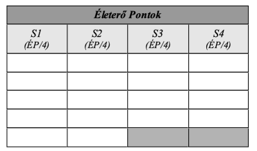

## Életerő pontok

Minden élőlény a benne keringő testi és lelki energiának, az életerőnek köszönheti, hogy különbözik a közönséges tárgyaktól. Ez az energia ad életet, ha elhagyja testünk, meghalunk. Ezt szimuláljuk az ún. Életerő pontokkal. Hogy kinek mennyi van belőle (mennyivel életerősebb), az a karakterek Edzettség értékétől függ. Kiszámolása a következőképpen történik:

```
ÉP = 12 + (Edzettség x 2)
```

<br />



A karakter aktuális fizikai állapotát az Életerő Pontok (`ÉP`) száma határozza meg, melyeket `4` egészség kategória közt a táblázatban egyenlő arányban (`össz ÉP 1/4-e minden oszlopba`) osztunk el. Ha maradékos az osztás, akkor a maradékot balról jobbra osszuk el.

Ezek az ún. `sebesülés kategóriák` szimulálják, hogy milyen állapotban van a karakter. Az `S1` az enyhén sérült, az `S4` pedig a halálosan sérült állapotot jelöli.

Az egyes kategóriák jelölésében az `S` a „Sebesülés” -re utal, a szám utána pedig könnyen azonosítja állapotunkat. A fenti ábra `18ÉP` elosztását mutatja be.

`Kábulat ÉP (KT)`: Verekedésnél, leütésnél, kábulatnál, rosszullétnél használjuk a Kábulat ÉP Pontot (`KT`). Hatása ugyanolyan, mint az ÉP vesztés (lásd [Sebesülés](060_01_eletero.md#sebes%C3%BCl%C3%A9s) fejezet), de nem okozhat halált, mivel nem jár strukturális károsodással. `Óránként 1 jön vissza`. (`Alvás közben óránként 2`) Alapállapotban nem létezik. Kifejtését lásd a [Harcrendszer Életerő - Kábulat ÉP](060_01_eletero.md#k%C3%A1bulat-%C3%A9leter%C5%91-pont-kt) fejezetében.
