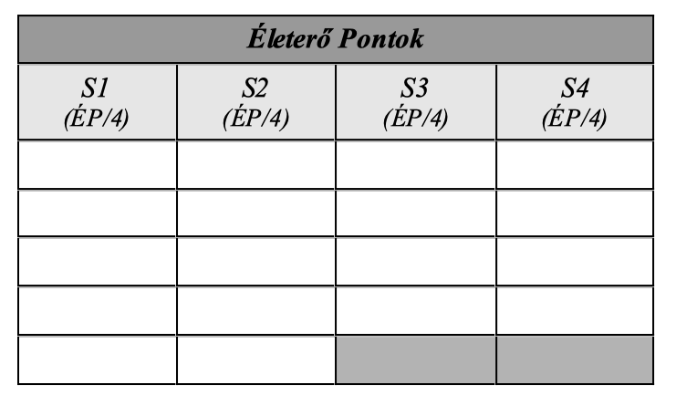

## Életerő pontok (ÉP)

Minden élőlény a benne keringő testi és lelki energiának, az életerőnek köszönheti, hogy különbözik a közönséges tárgyaktól. Ez az energia ad életet, ha elhagyja testünk, meghalunk. Ezt szimuláljuk az ún. **Életerő pontokkal**. Hogy kinek mennyi van belőle (mennyivel életerősebb), az a karakterek ⚪**Edzettség** értékétől függ. Kiszámolása a következőképpen történik:

```
ÉP = 12 + (Edzettség x 2)
```



A karakter aktuális fizikai állapotát az Életerő Pontok (`ÉP`) száma határozza meg, melyeket `4` egészség kategória közt a táblázatban egyenlő arányban (`össz ÉP 1/4-e minden oszlopba`) osztunk el. Ha maradékos az osztás, akkor a maradékot balról jobbra osszuk el.

Ezek az ún. `sebesülés kategóriák` szimulálják, hogy milyen állapotban van a karakter. Az `S1` az enyhén sérült, az `S4` pedig az életveszélyesen sérült állapotot jelöli.

Az egyes kategóriák jelölésében az `S` a „Sebesülés” -re utal, a szám utána pedig könnyen azonosítja állapotunkat. A fenti ábra `18 ÉP` elosztását mutatja be.

---
### Fáradtság Pont (FP)

Kifejtését lásd a **Harcrendszer** [Életerő - Fáradtság Pont](061_02_faradsag_pont.md) fejezetében.

Verekedésnél, leütésnél, rosszullétnél használjuk a Fáradtság Pontot (`FP`).\
Hatása ugyanolyan, mint az ÉP vesztés (lásd [Sebesülés](061_03_sebesules.md) fejezet), de nem okozhat halált, mivel nem jár strukturális károsodással.

`1)`Óránként `1 FP` tűnik el (alvás közben `2 FP`)\
`2)`Alapállapotban nem létezik. 

---

🔗 [Manőver Pontok](017_03_manover_pontok.md) →

⚜️ [Nyitóoldal](start.md#1-karakteralkot%C3%A1s)
