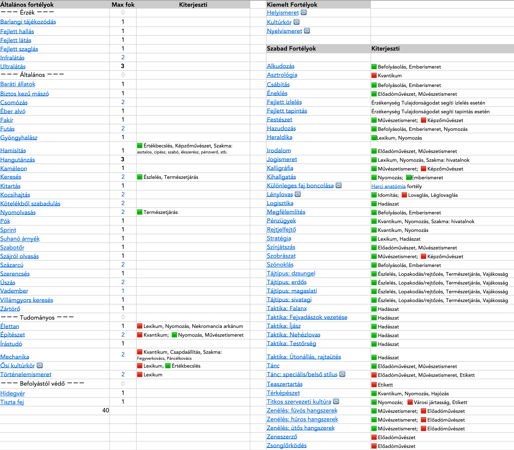

## Fortélyok képzettségkiterjesztés listája

🟩 Normál kiterjesztés\
🟥 Erős kiterjesztés

---

🔗 [Bázis képzettségek](039_bazis_kepzettsegek.md) →

⚜️ [Nyitóoldal](start.md#3-k%C3%A9pzetts%C3%A9grendszer)
