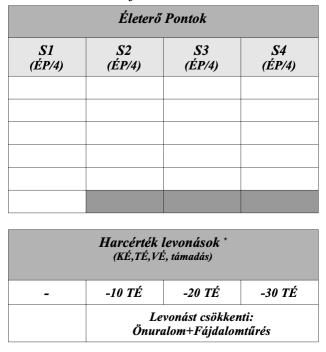
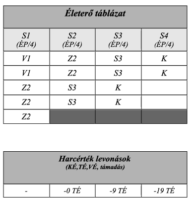

### Sebesülés

Ha a karakter találatot kap, harcértékeit - fizikumától függően - levonások sújtják. Persze ami például egy nyeszlett alakot az összeesés szélére sodor, az nem okoz akkora hátrányt egy edzett korgnak.

Ezért kerültek bevezetésre a sebesülés kategóriák. A karakter Életerejét 4 kategória szimbolizálja, melyek között karakteralkotáskor kell elosztani az **Életerő Pontokat.** (Lásd [Karakteralkotás – Életerő Pontok](017_01_ep_kt.md))

Mikor a karaktert sebesülés éri, elkezdi bejelölni az Életerő táblázatban a legmagasabb (`S1`) kategóriában lévő mezőket fentről lefelé. Mikor az első oszlop „betelt”, folytatja az `S2`, majd az `S3` kategóriában levőkkel és így tovább.

Hasznos segítség lehet, ha sérüléskor nem beikszeljük az egyes négyzeteket, hanem a sebesülés „sorszámát” (hányadik seb a harc során) és annak jellegét (S,V,Z) írjuk beléjük (Szúró,Vágó,Zúzó), megkönnyítve a dolgunkat: rögtön látjuk, hány és mekkora sebünk van. (A Kábulat ÉP (KT) sérülések mezőbe pedig „`K`” betűt írjunk). Példa: „`Z2`” jelölés 4db rubrikában: ez a karakter második sebe és egy 4 ÉP-s zúzott sebet jelöl.

Az első (`S1`) kategóriában lévő karaktert még nem sújtják negatív módosítók, sérülése – számára – olyan könnyű, ami nem akadályozza a harcban.

Az `S2`, `S3` és `S4` kategóriákba kerülve viszont már rendre `-10`; `-20` és `-30` `TÉ` a harcérték büntetés. Ezeket az értékeket viszont mérsékli az `Önuralom` tulajdonság és a Fájdalomtűrés képzettség összege. Így tehát a levonások értéke karakterenként változik.

`0 ÉP`-re érve a karakter elájul, és haldokolni kezd (Lásd [Haldoklás](#haldokl%C3%A1s)). Ha további sebet kap, meghal.

---
#### Fájdalomtűrés

A Fájdalomtűrés képzettség fontos szerepet játszik a harcban elszenvedett sebek fájdalmának elnyomásában, illetve egyéb helyzetekben a kín elviselésében. Részben játéktechnikai gyorsítás miatt, részben azért teszünk különbséget a harc közben és azon kívüli fájdalomtűrés miatt, mert harc közben az adrenalin hatására jobban bírja a karakter a fájdalmat, valamint próbáltuk a harc heroizmusát megőrizni.

---
#### Fájdalomtűrés harc közben

Ha harc közben más sebesülés kategóriába (S) lép a karakter, akkor fix `TÉ` levonást kap büntetésül. Ennek értékét csökkenti statikusan az alábbiak összege:\
`Önuralom + Fájdalomtűrés`

|     -      | S1  | S2  | S3  | S4  |
| :--------: | :-: | :-: | :-: | :-: |
| TÉ levonás |  -  | -10 | -20 | -30 |

#### S4 kategóriás fájdalomtűrés
⭕[Harci láz ad bónuszt?](https://github.com/kaktusztea/km100/wiki/TODO.ISSUE.fortelyok#harci-l%C3%A1z)

Ha a karakter az S4-es (Súlyosan sebesült) kategóriába ér egyszeri [Fájdalomtűrés](kepzettsegek.primer.altalanos/fajdalomtures.md) próbát kell dobnia Nehéz (`12`) célszám ellen.
`Fájdalomtűrés (K) + Edzettség (T)  vs.  12`

Siker esetén ezt a próbát a következő sebesüléskor kell csak újradobnia.

---
#### ⚡ Példa Fájdalomtűrésre

Tetves, a tolvaj Fájdalomtűrése `7.szintű`, `Önuralma:+1` (`összesen:8`)
Ekkor az ő sebesülés táblázata így néz ki:

| - | S1 | S2 | S3 | S4 |
| :-----: | :----: | :----: | :----: | :----: |
| TÉ levonás | - | -2 | -12 | -22 |

---
#### Fájdalomtűrés harcon kívül

Mérgezés, kínzás, egyéb fájdalom esetén a karakterek Fájdalomtűrés-próbát kell dobnia a KM által meghatározott célszámra.

---
#### Sérülés hatása képzettségpróbára

Ha megsérül a karakter, képzettségpróbáira levonások járnak. Hogy mennyi, az attól függ, hogy melyik sebesülés kategóriában van, illetve hogy fizikai mozgást igénylő, vagy nem igénylő képzettségét teszi próbára:

| - | S1 | S2 | S3 | S4 |
| :-----: | :----: | :----: | :----: | :----: |
| Fizikai képzettség | - | -2 | -4 | -6 |
| Egyéb képzettség | - | - | -1 | -3 |

---
#### ⚡ Példa a sebesülésre

Az alábbi példa Lord Gustav – Domvik lovagjának – egészség kategóriáit mutatja. `17 ÉP`-je van, `Önuralom` tulajdonságának és `Fájdalomtűrés` képzettségének összege pedig `11`.
`(Önuralom + Fájdalomtűrés) = 11`

Ebben az esetben az ő Életerő táblázata a következőképpen néz ki: minden oszlopba `4` - `4` `ÉP` kerül (`17 / 4` kerekítve). A maradék `1 ÉP`-t pedig balról jobbra „osztjuk el”, tehát az `S1` oszlopba kerül.

Sebek jellegének jelölései:
- **S: Szúrt seb**
- **V: Vágott seb**
- **Z: Zúzott seb**
- **K: Kábulat ÉP**

Találat esetén a sebesülést először az `S1` rubrikában kezdjük jelölni, oszlopon belül pedig fentről lefelé. Ha Lord Gustav egy `2 ÉP`-s sebet kap, az az `S1` oszlopban kerül bejelölésre fentről lefele. Ilyenkor még nem sújtja levonás.

Gustav ismét megsebesül. Ezúttal `5 ÉP`, ezzel az `S2` kategóriába kerül. Mivel a `(Fájdalomtűrés+Önuralom=11)` mérsékli a standard `S2`-nél használt (`-10TÉ`) büntetést, ezért még itt sincs `TÉ` levonás.

A harmadik seb `4 ÉP`, Gustav a harmadik (közepesen sérült) kategóriába kerül. Alapból (`-20TÉ`) lenne a büntetés, de ez (`-9TÉ`)-re mérséklődik (`-11`).

Gustav hátrálás közben belefejel a kovácsoltvas kapuba. `4KT` a büntetése. Ezzel az `S4` (utolsó) kategóriába került. Büntetése `-19TÉ` (a `-30` helyett).

Mivel S4-es kategóriába került, jön az [automatikus Fájdalomtűrás próba](#s4-kateg%C3%B3ri%C3%A1s-f%C3%A1jdalomt%C5%B1r%C3%A9s) `12` (Nehéz) ellen Edzettséggel. Ha elrontja, akkor el is ájul.

Ha túléli a kalandot, akkor a „szerzett” `4 Kábulat ÉP` gyógyulása `4 óra` alatt, a sebek okozta ÉP csökkenés pedig a [Gyógyulás](061_04_gyogyulas.md) fejezetben meghatározott ütemben történik.

---
### Haldoklás

Ha a karakter ÉP-inek száma `0`-ra zuhan, akkor haldokolni kezd.

Ilyenkor dobnia kell egy `Edzettség` tulajdonságpróbát `Átlagos (5-ös)` nehézség ellen. Ha megdobja, életben marad, de `2 perc` múlva újra dobnia kell, míg nem stabilizálják. Ha elrontja, meghal.

**Stabilizálás**: `Sebgyógyítás`, vagy `Gyógyítás` képzettségpróba Átlagos (`9`) nehézség ellen. Ha egy karaktert stabilizáltak, akkor nem kell `Edzettség` próbát dobnia, de továbbra is igaz rá, hogy minden további sebzés azonnal végez vele.

---

🔗 [Gyógyulás](061_04_gyogyulas.md) →

⚜️ [Nyitóoldal](start.md#6-harcrendszer-%EF%B8%8F)
