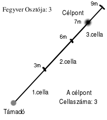

## Célpont Védő Értékének számítása

A célpont **Védő értéke** reprezentálja a célpont eltalálásának nehézségét. Ugyanolyan célszámként viselkedik, mint a rendes Védő érték, azaz, ha a lövést/hajítást végző karakter Célzó Értékkel együtt számított Támadó dobása eléri, vagy meghaladja ezen értéket, akkor találatról beszélünk. Amennyiben az érték alatta marad, a támadás célt téveszt.

A célpont **Védő Értékét**  az ún. **Szorzó** és a célpont Távolságának és a **Fegyver Osztó** hányadosának (felfele kerekítünk) szorzataként kapjuk meg.

🔆`Célpont VÉ = Szorzó  x  (Távolság / Fegyver Osztó) ↑`🔆

---
### ⚜️ Szorzó

A Szorzó a célpont egyedi jellemzőit, illetve a környezet hatásait szimulálja. Az alábbi módosítók **összege** adja meg értékét:

- \+ Mozgás módosító - célponté
- \+ Mozgás módosító - lövészé
- \+ Méret módosító - célponté
- \+ Észlelhetőség - célponté
- \+ Szél ereje

---
#### Szorzó - Mozgás módosító

Ha a célpont mozog, jóval nehezebb eltalálni. A távolság növekedésével ez a nehézség nem lineárisan, hanem exponenciálisan nő, éppen ezért érthető, hogy a mozgás is a Távolsági szorzó része. Alább az egyes mozgás típusokhoz tartozó módosítókat olvashatjuk.

| Célpont mozgásának jellege | Módosító | Megjegyzés                                                                                                                                                                  |
| :------------------------- | :------: | --------------------------------------------------------------------------------------------------------------------------------------------------------------------------- |
| Álló                       |   `3x`   | A célpont mozdulatlan                                                                                                                                                       |
| Lassú, egyenletes          |   `5x`   | Lassú séta, léptetés lovon. ⭕Többen harcolnak, bármelyik fél eltalálása jó. (Közéjük lövés)⭕ ⭕(Vagy: 3x (álló), méret bónusz (-1/2x). Aztán k6, h kit talált el)⭕ |
| Gyors, egyenletes          |   `8x`   | Egyenletesen futó ember, vágtató lovas                                                                                                                                      |
| Kiszámíthatatlan           |  `15x`   | A célpont ugrál össze-vissza, cikk-cakkban fut.                                                                                                                             |
| Harcoló célpont            |  `20x`   | Csak egy konkrét harcoló fél eltalálása jó.                                                                                                                                 |

Természetesen a lövést végző személy mozgása is befolyásolja a találati esélyeket, hiszen könnyebb állva célozni, mint mondjuk futásból. A lövész mozgása az alábbiak szerint módosíthatja a **Szorzót**:

| Lövész mozgása                     | Módosító |
| ---------------------------------- |:--------:|
| Mozdulatlan / Álló lövész          |  `+0x`   |
| A lövész lassan egyenletesen sétál |  `+2x`   |
| A lövész lassan fut                |  `+5x`   |
| A lövész rohan                     |  `+10x`  |

---
#### Szorzó - Méret módosító

| Célpont mérete           | Módosító |
| ------------------------ | :------: |
| Pénzérme                 |   +7x    |
| Alma                     |   +5x    |
| Fej, Dinnye, Macska      |   +4x    |
| Törpe, gyerek            |   +1x    |
| Átlagos ember/elf méretű |   +0x    |
| Ló oldalról, Ogre        |   -1x    |
| Lovas                    |   -2x    |
| Bölény                   |  ⭕TODO⭕  |
| Óriás                    |  ⭕TODO⭕  |

→ 🔺ISSUE: [Túl kicsi a fej szorzója](https://github.com/kaktusztea/szilankrpg/wiki/TODO.ISSUE.tavharc#l%C3%B6v%C3%A9szet-haj%C3%ADt%C3%A1s-kaland-tapasztalatok)

→ 🔺ISSUE: [Ha a szorzó 0-ra, vagy az alá csökkenne](https://github.com/kaktusztea/szilankrpg/wiki/TODO.ISSUE.tavharc#km100-c%C3%A9lz%C3%A1s-szorz%C3%B3).

---
#### Szorzó - Észlelhetőség módosító

A látási viszonyok erősen meghatározzák a távolsági harcot, hiszen például félhomályban sokkal nehezebb eltalálni valakit, mint fényes nappal. Viszont... könnyebb valakit eltalálni sötétben, ha zajt ad ki. Ezeknek megfelelően a fenti körülmények is módosítják a Szorzó értékét. A fentieket az alábbi táblázatokban foglalhatjuk össze.

| Környezeti fényviszonyok | Szorzó Módosító |                 Megjegyzés                 |
| ------------------------ | :-------------: |:------------------------------------------ |
| Szürkületben             |      `+2x`      | Szürkületben nehezebb a távolság becslése. |

| A célpont láthatósága és hangossága    |            Szorzó Módosító            | Példa                                                             |
| -------------------------------------- | :-----------------------------------: | :---------------------------------------------------------------- |
| Jól kivehető kontúr                    |                 `+0x`                 | Nappali célpont; napnyugtakor háztetőn álldogáló célpont          |
| Homályos kontúr                        |                 `+3x`                 | Félhomályban mozgó alaké; Testközelben levő célpont sötétben |
| Éppen kivehető kontúr (zajos)          |                 `+6x`                 | Sötétben moccanó, neszező árnyak                                  |
| Éppen kivehető kontúr (csendes)        |                `+15x`                 | Sötétben, csendben lapuló árnyak                                  |
| Háttérrel egybeolvadó kontúr (zajos)   |                `+15x*`                | Vaksötétben harcoló ellenfél; Távoli célpont sötétben        |
| Háttérrel egybeolvadó kontúr (csendes) | Lehetetlen. Csak 100-as dobás esetén. | Nem látható, lopakodó, némán osonó fejvadász                      |

\* Csak speciális mentális gyakorlat segítségével.

---
#### Szorzó - Szél hatása

Amennyiben erős szél fúj, akkor az is módosíthatja a célpont Védő Értékét, mivel az erős széllökések eltéríthetik a lövedéket.

| Szél ereje  |  Szorzó módosító   |
| ----------- | :----------------: |
| Nagyon erős |        +4x         |
| Viharos     |        +8x         |
| Orkán erejű | A lövés lehetetlen |

---
### ⚜️ Fegyver Osztó

A fegyver **Osztó** egy méterben megadott távolságérték és fegyverenként változik. Azt mutatja meg, hogy hány méterenként nő **az adott fegyverrel szemben** a célpont **Védő Értéke**. Gyakorlatilag azt befolyásolja, hogy a cél távolságának növekedésével milyen ütemben romlik találati esélyünk.

Érthető, hogy egy nyílpuska **Osztója** nagyobb, mint egy dobótőré, hiszen az előbbivel jó eséllyel támadhatunk akár `30-40` méterre levő célpontot is, míg egy dobótőr esetében ez már a lehetetlen kategóriába tartozik.

⚡Példa: a **Könnyű nyílpuska** **Osztója** `4`. Tehát `4` méterenként nő vele szemben a célpont Védő Értéke.

$$ {cél\ távolsága\ (m) \over fegyver\ Osztó} → felfelé\ kerekítünk $$

Ez a hányados adja meg, hogy a fegyver **Osztójához** viszonyítva hányadik távolság “cellában” található a célpont. A Védő Érték kiszámításánál ezzel a számmal lesz beszorozva a célpont **Szorzója**, amelyet feljebb tárgyaltunk.

Például ha egy hosszú íjjal (melynek **Osztója** `3`) lövünk egy `7` méterre levő célra, akkor a hányados: `3`. \
`7/3 → 3` mivel a `7` osztva `3`-al, felfelé kerekítve egyenlő `3`-al.

Az egyszerűség kedvéért álljon erről itt egy ábra, melyről megérthetőek a fentiek.

Ha a fegyver Osztója nem `3`, hanem mondjuk `2` lenne, akkor következésképpen a célpont a `4.` "cellában" lenne (`7/2`).

Alább az egyes fegyver-kategóriák tipikus **Osztó** értékét látjuk. Ettől csak rendkívül kevés esetben tér el egyik-másik konkrét fegyver, azok is csak nagyon indokolt esetben. Látható, hogy minél pontosabb egy fegyver, annál nagyobb az **Osztó** értéke.

| Fegyverkategória                    | Osztó | Példa fegyverek                                        | Speciális                                                                                                                         |
| ----------------------------------- | :---: | ------------------------------------------------------ | --------------------------------------------------------------------------------------------------------------------------------- |
| **Nem hajításra készített tárgyak** |  `1`  | Kard, zsámoly, söröskorsó                              | Maximális Hatótávjukhoz hozzáadható:   (`Erő x Osztó`)                                                                         |
| **Apró hajítófegyverek**            |  `2`  | Tőr, dobótőr, hajítóbárd, kő                           | -                                                                                                                                 |
| **Íjak**                            |  `3`  | Rövid íj, hosszú íj,   + Kézi nyílpuska,   dárda | Sebzés bónusz: Erő tulajdonság   (ha erre az Erőre lett tervezve)                                                              |
| **Nyílpuskák**                      |  `4`  | Minden nyílpuska   kivéve Kézi és Kharei            | A kézi nyílpuskától felfelé Páncéltörőnek számítanak:  `SFÉ = a vért rétegeinek száma` (mágikus vértek esetén a KM dönt) |
| ...                                 |  ...  | ...                                                    | ...                                                                                                                               |
| Modern, nagy hatótávú fegyver       | `10`  | Távcsöves mesterlövész puska                           | Ezt csak azért írjuk be, hogy látszódjon, ez a távolsági harcrendszer kiválóan adaptálható modern szerepjáték világokra is.       |

🔆 **Megjegyzés**: Javasoljuk a KM-nek, hogy ha esetleg mágikus, vagy kifejezetten jó minőségű fegyver értékeit akarja az alapértékhez képest módosítani, akkor az **Osztó** értékét lehetőleg **NE** módosítsa, inkább a fegyver **Célzó Értékét** változtassa.

---

🔗 [Távharc taktikák](073_tavharc_taktikak.md) →

⚜️ [Nyitóoldal](start.md#7-t%C3%A1vols%C3%A1gi-harcrendszer-)
